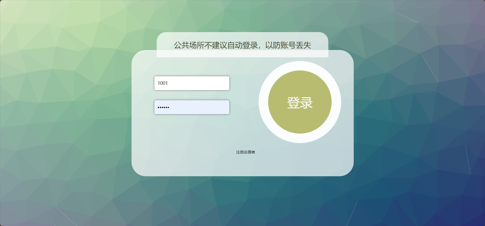
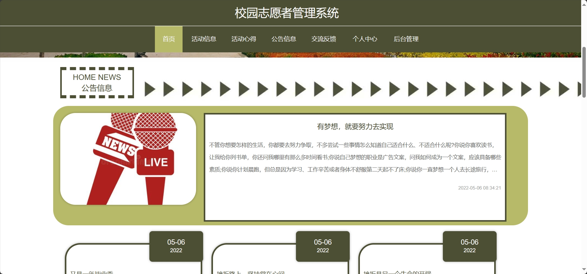
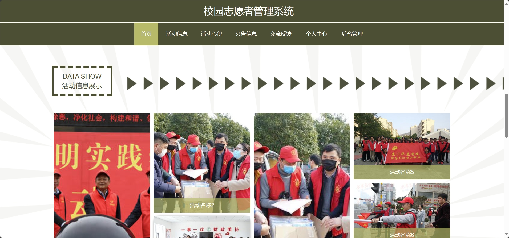
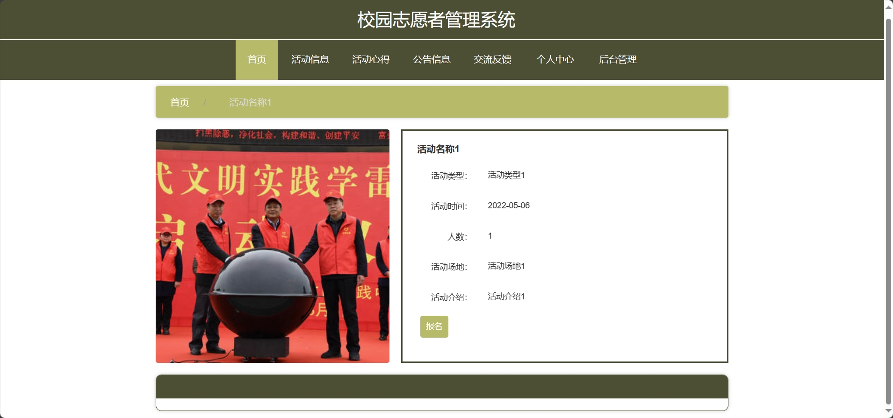
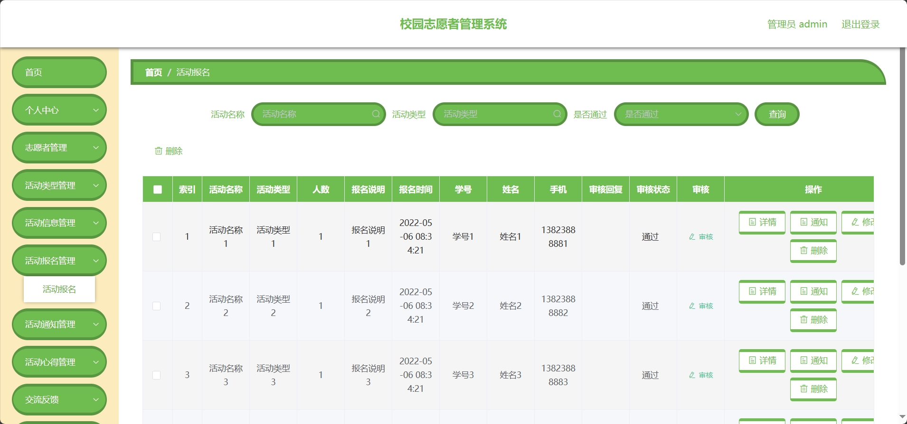
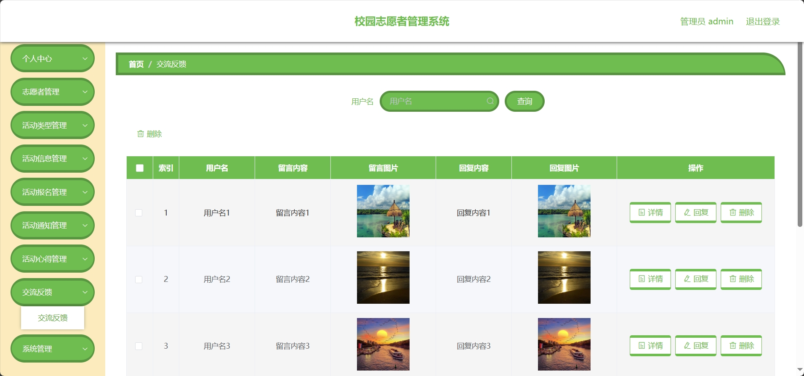
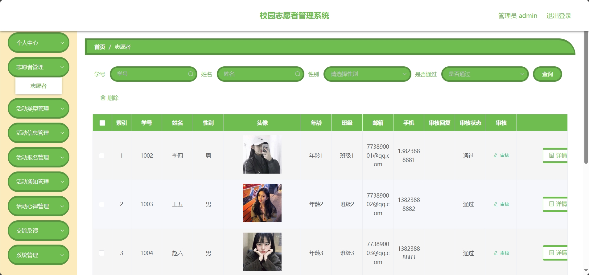

<h1 align="center">基于SSM的校园志愿者活动管理系统</h1>

<h4> 完整代码获取地址：从戎源码网（https://armycodes.com/） </h4>
<h4> 作者微信：19941326836 QQ：605739993 QQ群：655392706 </h4>
<h4> 承接计算机毕设、Java毕业设计、Python毕业设计、深度学习、机器学习 </h4>
<h4> 选题+开题报告+任务书+程序定制+安装调试+论文+答辩ppt 一条龙服务 </h4>
<h4> 毕业设计所有选题地址：(https://github.com/Descartes007/allProject) </h4>

## 一、项目介绍

基于SSM的校园志愿者活动管理系统：前端 Vue、ElementUI，后端 SpringBoot、Mybatis，系统角色分为：管理员和志愿者，管理员在管理后台发布志愿活动、对用户进行管理、对报名管理，管理交流反馈，对公告进行发布等；志愿者对根据发布的活动进行报名，并对活动收藏、发布心得等。主要功能如下：

### 1、管理员：

- 基本操作：登录、修改个人信息、上传图片、获取个人信息、修改密码
- 志愿者管理：获取志愿者列表、筛选志愿者信息、删除志愿者信息、编辑志愿者信息、审核志愿者、查看志愿者详情
- 活动类型管理：获取活动类型列表、删除活动类型信息、新增活动类型、修改活动类型信息、筛选活动类型
- 活动信息管理：获取活动列表、删除活动信息、新增活动信息、修改活动信息、审核活动、查看活动详情、筛选活动信息
- 活动报名管理：获取活动报名列表、删除活动报名、修改活动报名信息、审核活动报名、查看活动报名详情、筛选活动报名信息、通知报名者
- 活动通知管理：获取活动通知列表、删除活动通知、修改活动通知信息、查看活动通知详情、筛选活动通知信息
- 活动心得管理：获取活动心得列表、删除活动心得、修改活动心得信息、查看活动心得详情、筛选活动心得信息、查看评论、回复评论
- 交流反馈管理：获取交流反馈列表、删除交流反馈、修改交流反馈信息、查看交流反馈详情、筛选交流反馈信息、查看评论、回复评论
- 公告管理：获取公告列表、筛选公告信息、删除公告信息、发布公告、修改公告内容
- 轮播图管理：获取轮播图列表、发布轮播图、修改轮播图内容、查看轮播图详情

### 2、志愿者：

- 基本操作：登录、注册、修改个人信息、上传图片、获取个人信息
- 公告模块：获取公告列表、筛选公告信息、查看公告详情
- 活动模块：获取活动列表、筛选活动信息、查看活动详情、报名、获取活动报名列表、筛选活动报名信息、删除报名信息
- 活动心得模块：获取活动心得列表、筛选活动心得信息、查看活动心得详情、评论、收藏心得
- 交流反馈模块：获取交流反馈列表、筛选交流反馈信息、发布交流反馈、删除交流反馈
- 活动通知管理：获取活动通知、查看活动通知详情、筛选活动通知、删除活动通知
- 收藏管理：获取收藏列表、查看收藏详情、筛选收藏、删除收藏

## 二、环境

- <b>IntelliJ IDEA 2020.3</b>

- <b>Mysql 5.7.26</b>

- <b>NodeJs 14.17.3</b>

- <b>Maven 3.6.3</b>

- <b>JDK 1.8</b>

## 三、运行截图

